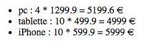
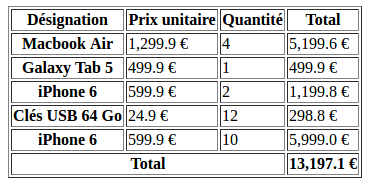
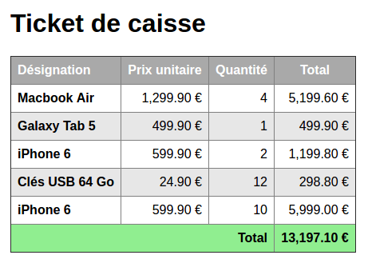

# Challenge S5-J2b
Intitulé : **Ticket de caisse**  
https://github.com/O-clock-Explorer/s3-j2-challenge-ticket-de-caisse-GuillaumeD84

Guillaume DURAND  
Promo : Explorer  
S5-J2 | 31/10/2017

Formateur : Jean-Christophe  
Type : PHP

## Objectif
Afficher le contenu d'un tableau dans une table HTML.

### Affichage simple
Afficher les articles, leur quantité et prix unitaire sous la forme d'une liste HTML.  

### Bonus 1 : Affichage via tableau HTML
Afficher le ticket de caisse sous forme d'un tableau HTML.  

### Bonus 2 : Améliorer l'affichage
Améliorer le rendu avec un peu de CSS.  

